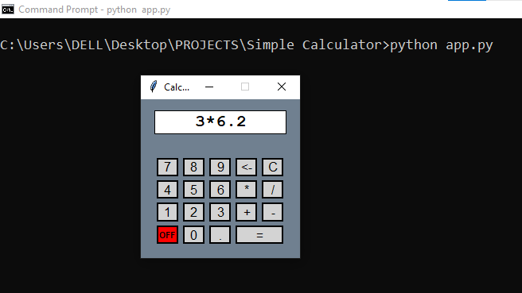

# Simple Python Calculator



A simple graphical user interface (GUI) calculator implemented in Python.
This calculator provides basic mathematical operations, making it useful for performing simple calculations.

## Features

- Addition
- Subtraction
- Multiplication
- Division

## Getting Started

These instructions will help you get a copy of the project up and running on your local machine.

### Prerequisites

To run this project, you'll need:

- Python3.x (3.9+ recommended) installed on your system.

### Installation

1. Clone the repository to your local machine:

   ```bash
   git clone https://github.com/farookie007/SimpleCalculator.git

2. Navigate to the project directory:
   
   ```bash
   cd SimpleCalculator

3. Run the calculator:

   ```bash
   python app.py

## Usage

To use the Simple Python Calculator:

- Enter numbers and perform calculations by clicking on the buttons.
- Click the "C" button to clear the input.
- Click the "=" button to calculate the result.
- The result will be displayed in the calculator's display area.

## License

This project is licensed under the GNU GENERAL PUBLIC LICENSE - see the [LICENSE.md](LICENSE.md) file for details.

## Acknowledgments

- Thanks to John Zelle's [Python Programming: An Introduction to Computer Science](https://books.google.com.ng/books/about/Python_Programming.html?id=aJQILlLxRmAC&redir_esc=y) for providing the GUI library.
